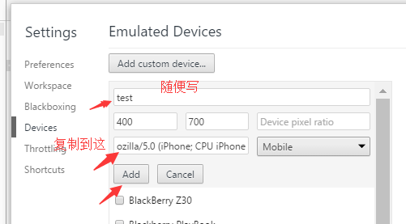
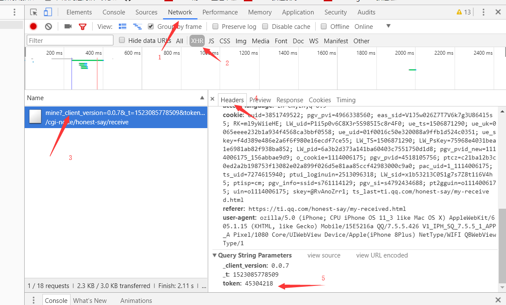

# honest_say
crack the honest_say of QQ

使用步骤
===

1、打开浏览器，按F12,然后按 ctrl+shift+M
---

2、添加移动设备（Edit）
---

3、将 ozilla/5.0 (iPhone; CPU iPhone OS 11_3 like Mac OS X) AppleWebKit/605.1.15 (KHTML, like Gecko) Mobile/15E5216a QQ/7.5.5.426 V1_IPH_SQ_7.5.5_1_APP_A Pixel/1080 Core/UIWebView Device/Apple(iPhone 8Plus) NetType/WIFI QBWebViewType/1 添加到Mobile的左边框，然后Add
---

 

4、选择刚才添加的设备，打开 链接 <a>https://ti.qq.com/honest-say/my-received.html</a>,打开链接前请按F12，用当前浏览器登录QQ空间
---

5、按F12，在Network选项下点击XHR，然后点击请求获得的文件，在header中的最下方将token值复制即可
---

 